# Architecture Diagrams - EduTutor

**Sản phẩm:** Trợ lý học tập cá nhân hoá dùng LLM + RAG (xem [`PRD.md`](./PRD.md))

Các sơ đồ dưới đây vẽ lại kiến trúc thật đang chạy, lấy trực tiếp từ code trong `backend/app/` - không phải kiến trúc dự kiến ban đầu. Tên biến môi trường, tên bảng, tên hàm trong ghi chú đều khớp với code hiện tại.

**3 nguyên tắc chi phối mọi sơ đồ dưới đây:**

1. Generator + Verifier là một pipeline 2 bước cố định, không phải agent tự quyết định hành động tiếp theo. Verifier là một lượt gọi LLM riêng, không nhận lịch sử hội thoại, chỉ chấp nhận câu trả lời có căn cứ trực tiếp trong đoạn trích hiện tại - đây là cơ chế chặn bịa duy nhất, không có bước con người duyệt tay từng câu trả lời.
2. Quyền truy cập là ranh giới vật lý, không phải bộ lọc sau khi tìm kiếm. Mỗi `user_id` có 1 FAISS index riêng trên đĩa (`{user_id}.faiss` + `{user_id}.meta.pkl`), không có index chung để lọc lẫn nhau.
3. Guardrail rẻ chạy trước, LLM đắt chạy sau. Câu hỏi được lọc qua 3 tầng: 2 tầng đầu rule-based miễn phí (chặn ngay yêu cầu làm bài hộ và pattern injection/jailbreak rõ ràng), chỉ tầng 3 (câu hỏi mơ hồ) mới tốn 1 lượt gọi Gemini làm gatekeeper - đỡ tốn quota free tier.

---

## Công nghệ dùng cho từng phần

| Thành phần | Công nghệ | Ghi chú |
| --- | --- | --- |
| Frontend | React 18 + Vite + React Router + Tailwind CSS | chạy dev server, chưa deploy production trong scope này |
| Backend API | FastAPI (Python) + Uvicorn | đồng bộ: upload, hỏi đáp, sinh quiz/flashcard, mastery, kế hoạch học tập |
| Xử lý nền | FastAPI `BackgroundTasks`, chạy trong cùng process, không có queue/worker riêng | đủ dùng cho quy mô 1 người dùng cục bộ hiện tại |
| Database | SQLite qua SQLAlchemy | file `edututor.db`, chưa có Alembic nên đổi schema phải xoá DB cũ tạo lại |
| Vector store | FAISS `IndexFlatIP` local, 1 index riêng cho mỗi user | inner product trên vector đã L2-normalize = cosine similarity |
| Full-text/lexical search | BM25 (`rank_bm25`), build lại từ đầu mỗi lần gọi `hybrid_search()` | chấp nhận được vì mỗi user có corpus nhỏ; tokenizer chỉ tách `\w+` + lowercase, chưa word-segmentation tiếng Việt thật |
| Fusion | Reciprocal Rank Fusion (k=60) | không cần chuẩn hoá thang điểm giữa cosine và BM25 |
| Embedding | `sentence-transformers/paraphrase-multilingual-mpnet-base-v2`, chạy local | miễn phí, không giới hạn, để dành quota Gemini cho generator/verifier |
| Rerank | `cross-encoder/mmarco-mMiniLMv2-L12-H384-v1`, chạy local | chấm điểm liên quan trực tiếp (query, chunk); điểm chuẩn hoá qua sigmoid về (0,1) |
| LLM | Google Gemini API (`gemini-3.1-flash-lite`, free tier) | có retry backoff khi gặp lỗi 429 |
| File storage | đĩa cục bộ (`backend/data/uploads`) | không dùng object storage ngoài |

---

## Mục lục

| # | Sơ đồ | Nội dung chính | Loại |
| --- | --- | --- | --- |
| 1 | Bối cảnh hệ thống | ai dùng, tài liệu từ đâu, dịch vụ AI nào được gọi | flowchart |
| 2 | Kiến trúc thành phần | trách nhiệm và công nghệ từng phần, 2 nhánh nạp tài liệu và hỏi đáp | flowchart |
| 3 | Luồng nạp tài liệu | từ upload tới sẵn sàng truy hồi, xử lý nền không chặn request | flowchart |
| 4 | Sequence nạp tài liệu | cơ chế polling 2 giây giữa frontend và API | sequence |
| 5 | Agent/pipeline hỏi đáp | guardrail, phân loại ý định, generator + verifier | flowchart |
| 6 | Hybrid retrieval | lọc theo user trước, 2 nhánh truy hồi song song, RRF, rerank | flowchart |
| 7 | Sinh quiz/flashcard + mastery | generator sinh hàng loạt, verify từng item, cập nhật mastery | flowchart |
| 8a | Bản đồ dữ liệu | 11 bảng gom thành 3 cụm | flowchart |
| 8b | Schema chi tiết | trường, kiểu dữ liệu, khoá | ER |
| 9 | Vòng đời tài liệu | trạng thái nghiệp vụ, versioning | state |
| 10 | Triển khai | cái gì chạy ở đâu | flowchart |

---

## 1. Bối cảnh hệ thống

Người dùng tải tài liệu học tập của mình vào hệ thống. Hệ thống gọi các dịch vụ AI ngoài (Gemini để sinh nội dung, model local để embedding/rerank) nhưng không tự tìm Internet để trả lời.

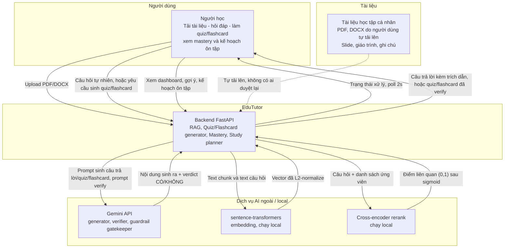

Không có lớp "văn bản tham chiếu bên ngoài" nào - hệ thống cố tình không tìm Internet trực tiếp, để câu trả lời luôn bám vào đúng tài liệu người học đã tải lên.

---

## 2. Kiến trúc thành phần

Không có worker process riêng - xử lý tài liệu chạy nền trong cùng process FastAPI qua `BackgroundTasks`.

```mermaid
flowchart TB
    subgraph giaodien["Giao diện - React 18 + Vite"]
        UIUP["UploadPage - quản lý tài liệu, poll trạng thái 2 giây"]
        UICHAT["ChatPage - hỏi đáp + sidebar lịch sử hội thoại"]
        UIQUIZ["QuizPage - làm quiz, xem đáp án/giải thích"]
        UIDASH["DashboardPage - mastery, tài liệu gần đây"]
    end

    subgraph api["API - FastAPI + Uvicorn"]
        DOCSVC["documents.py<br/>Nhận file, versioning, đẩy BackgroundTask, xoá tài liệu"]
        CHATSVC["chat.py<br/>Guardrail + retrieval + RAG + gợi ý học tiếp theo + lịch sử"]
        QUIZSVC["quiz.py<br/>Sinh quiz đa tài liệu, chấm bài, cập nhật mastery"]
        FCSVC["flashcard.py<br/>Sinh flashcard từ tài liệu"]
        MASTERYSVC["mastery.py (router)<br/>Đọc dashboard mastery"]
        PLANSVC["study_plan.py<br/>Tính kế hoạch ôn tập theo số ngày còn lại"]
    end

    subgraph nen["Xử lý nền - trong cùng process API"]
        BGTASK["_run_processing_job - FastAPI BackgroundTasks<br/>Parse, Chunk, Embed, Index"]
    end

    subgraph logic["Logic thuần Python - test được không cần FastAPI"]
        RAGLOGIC["app/llm/rag.py<br/>generator + verifier"]
        GUARD["app/llm/guardrail.py<br/>3 tầng chặn"]
        QUIZLOGIC["app/llm/quiz_generator.py, flashcard_generator.py"]
        MASTERYLOGIC["app/mastery.py<br/>recency-weighted formula"]
        PLANLOGIC["app/study_planner.py<br/>round-robin theo ưu tiên"]
        RETR["app/retrieval/pipeline.py<br/>hybrid search + rerank"]
    end

    subgraph luutru["Lưu trữ"]
        SQLITE[("SQLite<br/>Document, Conversation, Message<br/>Quiz, Attempt, MasteryScore, ...")]
        FAISS[("FAISS index riêng theo user<br/>.faiss + .meta.pkl trên đĩa")]
        FILES[("Đĩa cục bộ<br/>backend/data/uploads")]
    end

    subgraph ngoai["Dịch vụ AI"]
        GEMINI["Gemini API"]
        EMBLOCAL["sentence-transformers (local)"]
        RRLOCAL["cross-encoder rerank (local)"]
    end

    UIUP -->|"Nạp 1: POST file"| DOCSVC
    DOCSVC -->|"Nạp 2: Ghi Document status=đang xử lý"| SQLITE
    DOCSVC -->|"Nạp 3: Lưu file gốc"| FILES
    DOCSVC -->|"Nạp 4: add_task ngay trong response"| BGTASK
    DOCSVC -->|"Nạp 5: trả document_id ngay"| UIUP
    UIUP -->|"Nạp 6: GET /documents mỗi 2 giây"| DOCSVC
    DOCSVC -->|"status hiện tại"| UIUP

    BGTASK -->|"Đọc file gốc"| FILES
    BGTASK -->|"Ghi Section/Chunk qua vectorstore, cập nhật status"| SQLITE
    BGTASK -->|"Embedding cho chunk"| EMBLOCAL
    BGTASK -->|"Ghi vector"| FAISS

    UICHAT -->|"Hỏi 1: câu hỏi + user_id"| CHATSVC
    CHATSVC -->|"Hỏi 2"| GUARD
    GUARD -->|"Gatekeeper, chỉ khi mơ hồ"| GEMINI
    CHATSVC -->|"Hỏi 3: lọc document_ids theo quyền + trạng thái"| RETR
    RETR -->|"Hỏi 4"| FAISS
    RETR -->|"Hỏi 5: embedding câu hỏi"| EMBLOCAL
    RETR -->|"Hỏi 6: rerank top ứng viên"| RRLOCAL
    RETR -->|"Hỏi 7: top-k đã rerank"| CHATSVC
    CHATSVC -->|"Hỏi 8"| RAGLOGIC
    RAGLOGIC -->|"generator + verifier"| GEMINI
    CHATSVC -->|"Hỏi 9: lưu Message + trả lời"| SQLITE
    CHATSVC -->|"Câu trả lời + trích dẫn"| UICHAT

    UIQUIZ -->|"Sinh quiz / nộp bài"| QUIZSVC
    QUIZSVC -->|"Truy hồi theo từng tài liệu"| FAISS
    QUIZSVC -->|"generator + verify từng câu"| QUIZLOGIC
    QUIZLOGIC -->|"gọi LLM"| GEMINI
    QUIZSVC -->|"Ghi Quiz/QuizItem/Attempt, cập nhật MasteryScore"| SQLITE

    FCSVC -->|"Cùng pattern với Quiz"| QUIZLOGIC
    MASTERYSVC -->|"Đọc MasteryScore đã cache"| SQLITE
    PLANSVC -->|"Đọc Topic/MasteryScore, tính lại mỗi lần gọi"| PLANLOGIC
    PLANLOGIC --> SQLITE

    UIDASH --> MASTERYSVC
```

---

## 3. Luồng nạp tài liệu

Không có hàng chờ duyệt của con người trước khi tài liệu vào truy hồi - tài liệu được dùng ngay khi xử lý xong, vì đây là tài liệu người dùng tự tải lên cho chính mình chứ không phải kho tri thức chung cần kiểm soát nguồn.

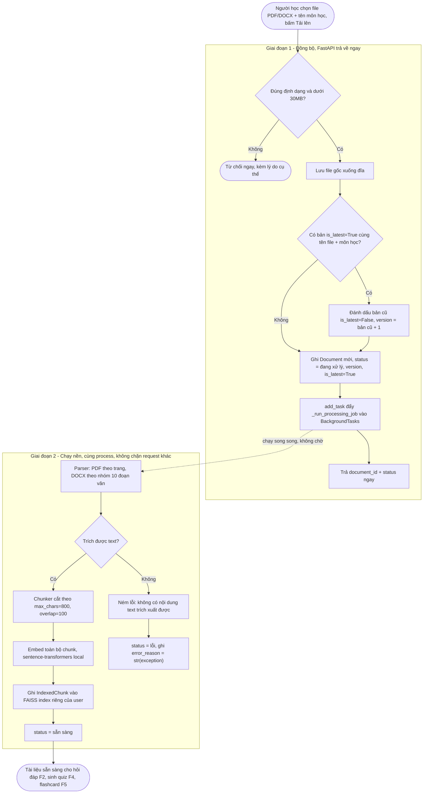

Metadata gắn vào mỗi chunk khi index (bước B5): `document_id` và tên tài liệu, `position_ref` (Trang n hoặc Mục n), `chunk_id` riêng. Không có khái niệm "trạng thái duyệt nội dung" ở cấp chunk hay tài liệu - cơ chế đảm bảo không bịa nằm ở verifier LLM khi trả lời (sơ đồ 5), không nằm ở việc kiểm soát ai được đưa tài liệu vào.

Chunk hiện đang cắt theo kích thước cố định (800 ký tự, overlap 100), không phải semantic chunking. Đây là baseline đơn giản, `eval/report.md` mục 3 có ghi lại đây là chỗ có thể cải thiện sau này.

---

## 4. Sequence - nạp tài liệu và theo dõi trạng thái

Không có bảng job với phần trăm tiến độ - chỉ có `Document.status` (đang xử lý / sẵn sàng / lỗi), frontend tự poll lại bằng `setInterval` 2 giây (`UploadPage.jsx`).

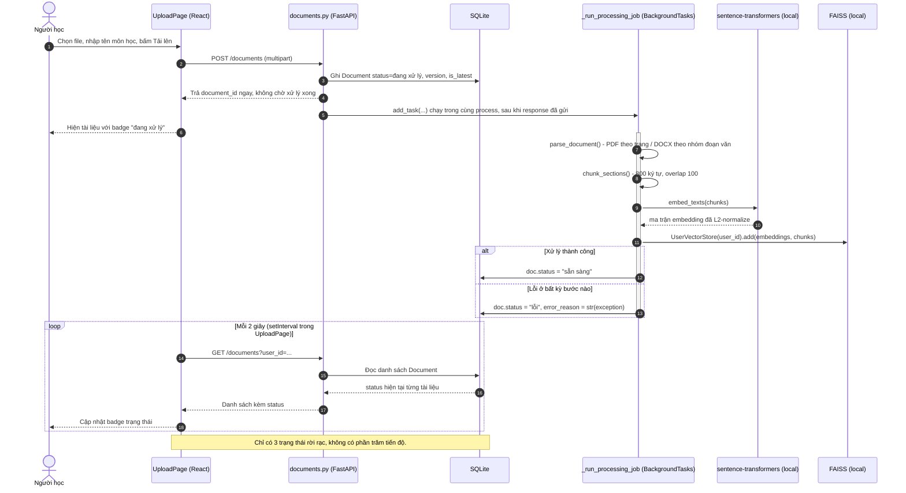

---

## 5. Agent/pipeline hỏi đáp

Đây là pipeline cố định, không phải agent tự chọn hành động tiếp theo (đã ghi rõ trong docstring của `app/llm/rag.py`). Hai nhánh dừng sớm: guardrail chặn và verifier từ chối.

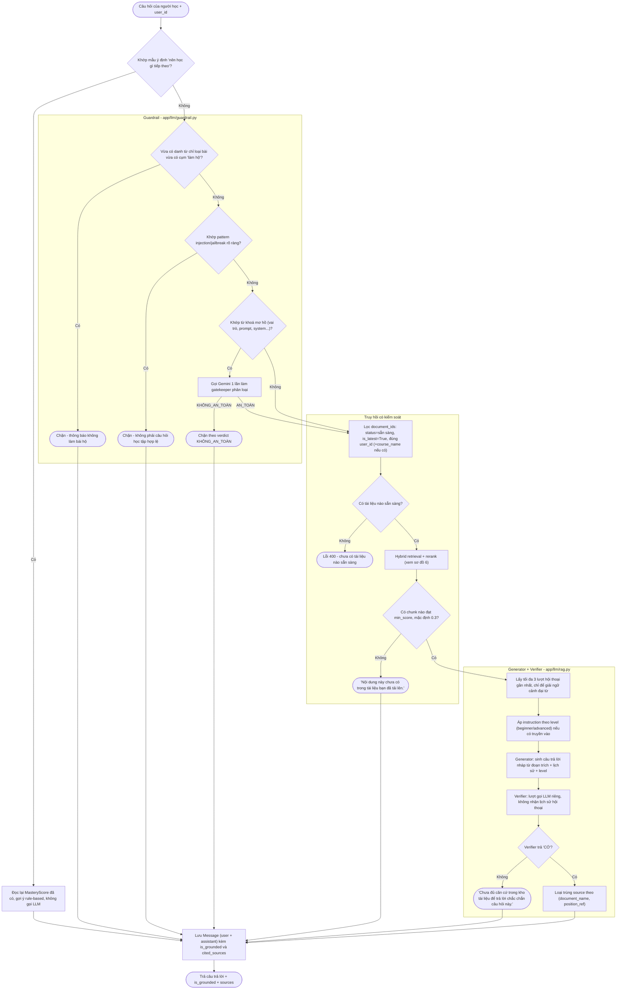

Không có nhánh riêng "phát hiện mâu thuẫn giữa nguồn rồi hỏi lại người dùng" - generator được chỉ dẫn tự nêu rõ khác biệt khi các đoạn trích đến từ nhiều nguồn mâu thuẫn nhau, nhưng đây là hành vi mong đợi ở output văn bản, không phải một nhánh graph riêng có kiểm tra sau đó.

---

## 6. Hybrid retrieval

Lọc theo quyền và trạng thái tài liệu xảy ra trước khi truy hồi (qua tham số `document_ids` truyền vào tận `UserVectorStore`), không phải lọc kết quả sau khi đã tìm kiếm trên toàn bộ corpus.

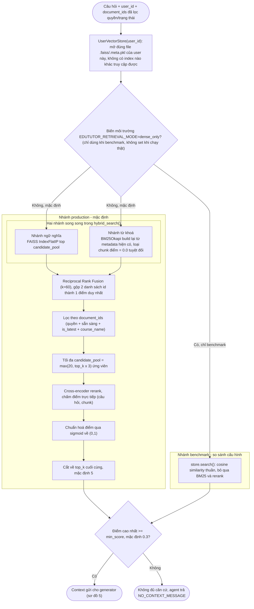

Vì sao cần cả 2 nhánh, đã đo bằng eval thật chứ không chỉ đoán theo lý thuyết:

| So sánh | Dense-only (Config A) | Hybrid + Rerank (Config B, đang chạy thật) |
| --- | --- | --- |
| Context Precision | 0.41 (N=22) | **0.77** (N=22), +0.36 |
| Citation Accuracy | 0.30 (N=20) | **0.75** (N=20), +0.45 |
| Faithfulness | 0.80 (N=40) | **0.90** (N=40), +0.10 |
| Ổn định qua 2 lần chạy độc lập | - | cả 3 chỉ số trên không đổi (0pp), nên chênh lệch trên là tín hiệu thật |

Nguồn: `eval/report.md` mục 14-15. Đánh đổi duy nhất thấy được: Hybrid+Rerank lọc gắt hơn nên đôi khi từ chối trả lời thay vì trả lời không hoàn chỉnh, ở câu hỏi so sánh 2 chủ đề tách biệt (xem mục 13 của `eval/report.md`).

---

## 7. Sinh Quiz/Flashcard và cập nhật mastery

Cùng một pattern generator sinh hàng loạt rồi verify từng item được dùng lại cho cả Quiz và Flashcard; nộp bài quiz là điểm duy nhất kích hoạt tính lại mastery.

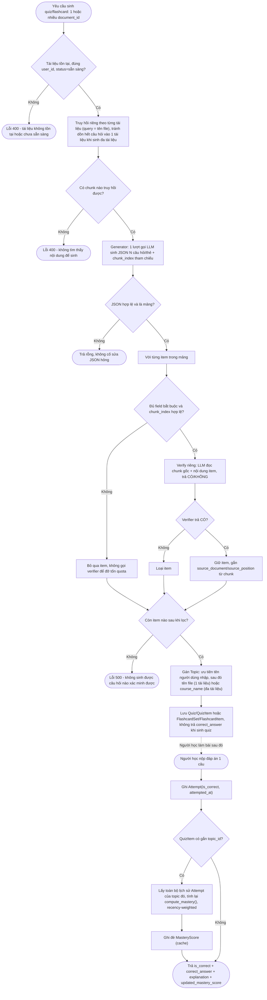

Điểm đáng chú ý đã đo được: Flashcard groundedness đạt 1.00 (N=6) trong khi Quiz groundedness chỉ đo 0.67 (N=9) dù dùng chung một pattern generator+verifier. `eval/report.md` mục 13 chỉ ra phần lớn "fail" của Quiz là do giám khảo chấm sai (hiểu nhầm việc hệ thống cố tình giấu đáp án ở bước sinh là thiếu sót), không phải lỗi groundedness thật. Cần sửa tiêu chí chấm trước khi kết luận Quiz kém hơn Flashcard.

---

## 8a. Bản đồ dữ liệu

11 bảng gom thành 3 cụm.

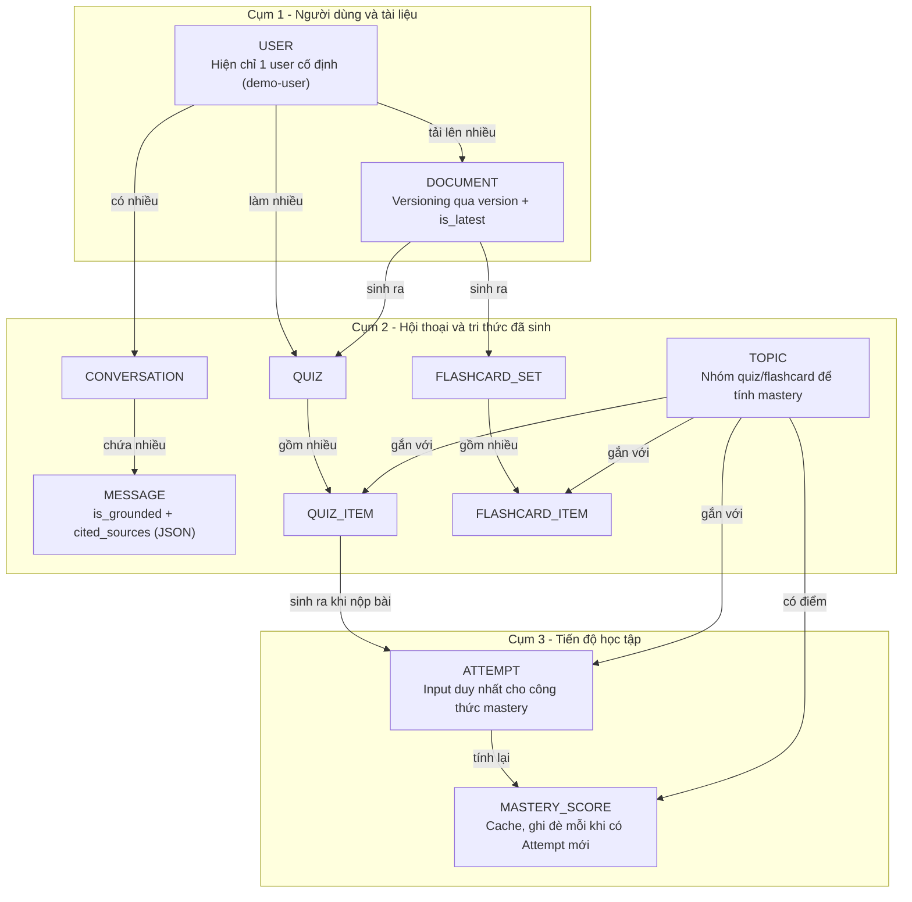

Không có bảng "chunk có trạng thái duyệt" - chunk (vector + text) sống trong FAISS/pickle, không phải bảng SQL riêng, không mang cờ duyệt nào. Việc không bịa được đảm bảo ở bước verifier khi trả lời (sơ đồ 5), không phải ở việc kiểm soát dữ liệu đầu vào.

---

## 8b. Schema chi tiết

Trường, kiểu dữ liệu và khoá của từng bảng SQL, lấy trực tiếp từ `app/models.py`. Chunk/vector không nằm trong SQLite mà nằm trong FAISS + file pickle metadata riêng (`app/vectorstore/faiss_store.py`), nên không xuất hiện trong ER này.

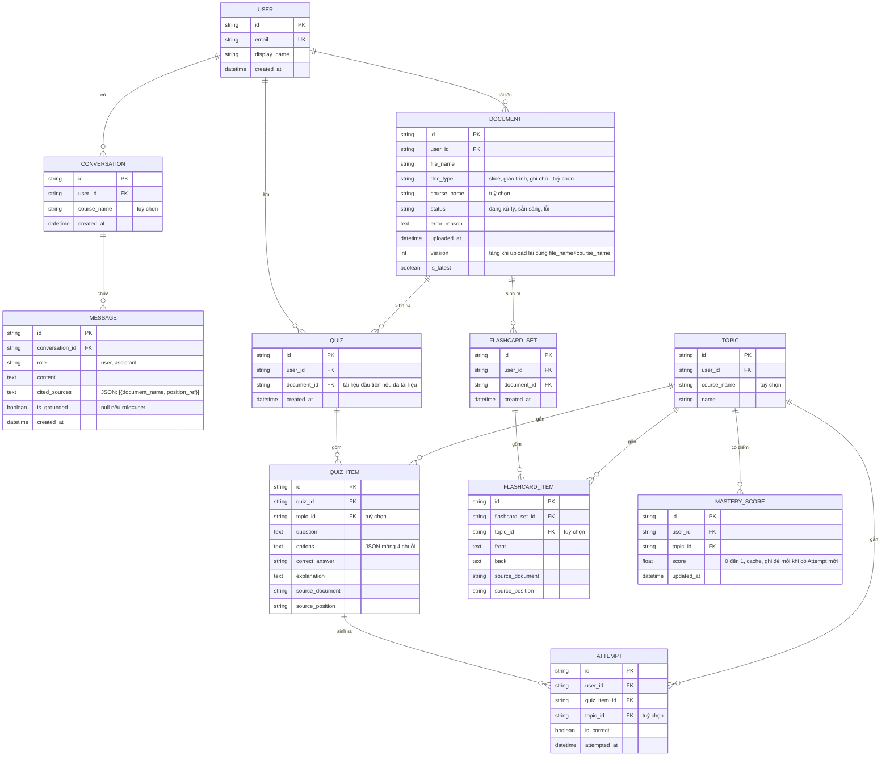

---

## 9. Vòng đời tài liệu

Ba trạng thái rời rạc, không có trạng thái trung gian theo phần trăm. Versioning là một trục riêng, không phải một trạng thái trong vòng đời xử lý.

```mermaid
stateDiagram-v2
    [*] --> DangXuLy: Upload, status = "đang xử lý"

    DangXuLy --> SanSang: Parse + chunk + embed + index thành công
    DangXuLy --> Loi: Bất kỳ bước nào lỗi, ghi error_reason

    Loi --> [*]: Người dùng xoá tài liệu lỗi và tải lại từ đầu (chưa có nút thử lại tự động)

    SanSang --> DangXuLy: Upload lại cùng file_name + course_name, bản này version+1, is_latest=True; bản cũ is_latest=False, vẫn giữ trạng thái sẵn sàng

    SanSang --> [*]: Xoá tài liệu, xoá file gốc, bản ghi DB, và toàn bộ vector liên quan trong FAISS

    note right of SanSang
        Chỉ tài liệu status=sẵn sàng và is_latest=True
        được dùng cho hỏi đáp (F2) và sinh quiz/flashcard (F4, F5).
        Bản cũ (is_latest=False) vẫn hiện trong danh sách tài liệu
        nhưng không được dùng làm căn cứ truy hồi mới.
    end note

    note right of DangXuLy
        Không có phần trăm tiến độ.
        Frontend chỉ biết 3 trạng thái qua poll GET /documents mỗi 2 giây.
        Không có hàng đợi Redis/RQ, xử lý chạy trong
        cùng process API qua FastAPI BackgroundTasks.
    end note
```

---

## 10. Triển khai

Một container duy nhất cho backend (API + xử lý nền trong cùng process); frontend chưa containerize trong `docker-compose.yml` hiện tại, chạy qua `npm run dev` khi phát triển.

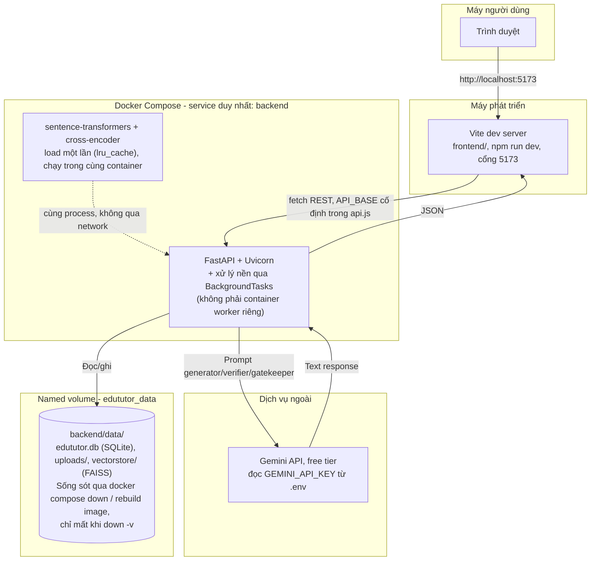

Vì sao một container là đủ: xử lý một tài liệu (parse + embed) mất vài giây tới vài chục giây với model local, không phải vài phút gọi LLM API cho nội dung dài, nên chấp nhận được khi chạy trong `BackgroundTasks` cùng process thay vì tách sang worker riêng như Celery/RQ. Đánh đổi: nếu nhiều người dùng cùng lúc tải tài liệu lớn, xử lý nền có thể cạnh tranh CPU với các request đồng bộ khác trong cùng process - chưa phải vấn đề ở quy mô 1 người dùng cục bộ hiện tại, nhưng là chỗ cần xem lại đầu tiên nếu sau này mở rộng sang nhiều người dùng thật.

Phương án thay thế nếu cần: tách `_run_processing_job` sang worker riêng (Redis + RQ) chỉ cần thiết khi có nhiều người dùng cùng lúc tải tài liệu lớn, chưa cần ở quy mô hiện tại.
