# Architecture Diagrams - EduTutor

**Sản phẩm:** Trợ lý học tập cá nhân hoá dùng LLM + RAG

Các sơ đồ dưới đây vẽ lại kiến trúc thật đang chạy trên nhánh hiện tại, lấy trực tiếp từ code trong `backend/app/` - không phải kiến trúc dự kiến ban đầu. Đây là bản viết lại toàn bộ sau khi hệ thống đã chuyển từ SQLite/FAISS/model local sang PostgreSQL+pgvector/Cohere và mở rộng thêm lớp cá nhân hoá; các mốc di trú quan trọng được ghi chú ngay tại sơ đồ liên quan thay vì gom vào một bản "lịch sử thay đổi" riêng.

**4 nguyên tắc chi phối mọi sơ đồ dưới đây:**

1. Generator + Verifier là một pipeline cố định, không phải agent tự quyết định hành động tiếp theo. Verifier là một lượt gọi LLM riêng, chấm theo từng câu (claim-level), chỉ chấp nhận claim có căn cứ trực tiếp trong đoạn trích hiện tại — đây là cơ chế chặn bịa duy nhất. Khi chỉ một phần câu trả lời qua được verifier, hệ thống trả về đúng phần đó kèm cờ `partial=true` thay vì từ chối toàn bộ hoặc giữ nguyên phần chưa xác minh được.
2. Quyền truy cập là ranh giới vật lý trong câu truy vấn SQL, không phải bộ lọc sau khi tìm kiếm. Mọi truy hồi (`PgVectorStore`) và mọi truy vấn bộ nhớ dài hạn (`MemoryEvent`) đều bắt buộc `WHERE user_id = ...` ngay trong câu query, không có bảng/API nào đọc chéo được dữ liệu của user khác.
3. Guardrail rẻ chạy trước, LLM đắt chạy sau. Câu hỏi được lọc qua nhiều tầng rule-based miễn phí (capability detection, phát hiện injection/jailbreak, phát hiện đại từ không có tiền ngữ) trước khi tới bước gọi LLM.
4. Cá nhân hoá là 3 lớp tách biệt, không gộp thành một con số duy nhất: hồ sơ tĩnh do người dùng tự khai (`LearningProfile`), điểm tổng hợp suy ra theo thời gian (`MasteryScore`/retention), và ký ức theo từng sự kiện cụ thể (`MemoryEvent`). `learner_context.py` là nơi DUY NHẤT gộp cả 3 lớp lại trước khi đưa vào prompt, để tránh mỗi nơi gọi lại tự viết logic gộp riêng.

---

## Công nghệ dùng cho từng phần

| Thành phần | Công nghệ | Ghi chú |
| --- | --- | --- |
| Frontend | React 18 + Vite + React Router + Tailwind CSS | 7 trang: Dashboard, Tài liệu, Hỏi đáp, Quiz, Flashcard, Kế hoạch ôn tập, Hồ sơ học tập |
| Backend API | FastAPI (Python) + Uvicorn | đồng bộ: upload, hỏi đáp, sinh quiz/flashcard, mastery, kế hoạch học tập, hồ sơ, môn học |
| Xử lý nền | FastAPI `BackgroundTasks`, chạy trong cùng process, không có queue/worker riêng | đủ dùng cho quy mô hiện tại; xem sơ đồ 11 để biết khi nào cần tách worker |
| Database | PostgreSQL qua SQLAlchemy + Alembic | **cùng một DB** chứa cả dữ liệu quan hệ VÀ vector (xem dòng dưới) — không có SQLite, không có Alembic thủ công nữa |
| Vector store | Cột `Vector(1024)` (pgvector extension) ngay trong bảng `document_chunks` và `memory_events` | không còn FAISS/file `.faiss` riêng — đã di trú để bỏ trạng thái đĩa cục bộ, phục vụ deploy stateless |
| Full-text/lexical search | Postgres full-text search: `to_tsvector('simple', text)` + GIN index, khớp `plainto_tsquery` | dùng config `'simple'` (không stemming tiếng Anh) vì nội dung chủ yếu tiếng Việt |
| Fusion | Reciprocal Rank Fusion (k=60) | gộp danh sách dense + full-text thành 1 điểm duy nhất trước khi rerank |
| Embedding | Cohere Embed API, model `embed-multilingual-v3.0` (1024 chiều) | gọi qua mạng (`COHERE_API_KEY`), thay cho sentence-transformers chạy local trước đây — bỏ được torch khỏi image, tránh cold-start tải model trên host không có đĩa bền vững |
| Rerank | Cohere Rerank API, model `rerank-multilingual-v3.0` | thay cho cross-encoder local trước đây — cùng lý do stateless/nhẹ image |
| LLM | OpenAI API (`gpt-4o-mini`, mặc định) hoặc Google Gemini API (`gemini-3.1-flash-lite`, dự phòng) | `app/llm/client_factory.py` tự chọn theo key có sẵn hoặc `LLM_PROVIDER` |
| File storage | Backblaze B2 (S3-compatible) qua `boto3` | thay cho đĩa cục bộ — trước đó từng dùng Cloudflare R2, đổi provider chỉ bằng sửa biến môi trường `STORAGE_*`, không sửa code |
| Deploy | Render (backend, Docker, free tier không đĩa bền vững) + Vercel (frontend) + Neon (Postgres+pgvector) | toàn bộ container **stateless** — xem sơ đồ 11 |

---

## Mục lục

| # | Sơ đồ | Nội dung chính | Loại |
| --- | --- | --- | --- |
| 1 | Bối cảnh hệ thống | ai dùng, tài liệu từ đâu, dịch vụ AI/hạ tầng nào được gọi | flowchart |
| 2 | Kiến trúc thành phần | routers, services, llm, retrieval, ingestion, vectorstore, memory | flowchart |
| 3 | Luồng nạp tài liệu | từ upload tới sẵn sàng truy hồi, gồm trích outline | flowchart |
| 4 | Sequence nạp tài liệu | cơ chế polling 2 giây giữa frontend và API | sequence |
| 5 | Agent/pipeline hỏi đáp | capability detection, guardrail, phân luồng Summarize/Compare/Apply/QA, generator + verifier theo claim | flowchart |
| 6 | Hybrid retrieval | pgvector + Postgres full-text, RRF, Cohere rerank, 2 pha strict/wide | flowchart |
| 7 | Cá nhân hoá & bộ nhớ | 3 lớp cá nhân hoá gộp qua `learner_context`, learning state/policy, misconception, retention/spaced repetition | flowchart |
| 8 | Sinh Quiz/Flashcard + mastery + spaced repetition | generator sinh hàng loạt, verify từng item, cập nhật mastery/lịch ôn | flowchart |
| 9a | Bản đồ dữ liệu | 17 bảng gom thành 4 cụm | flowchart |
| 9b | Schema chi tiết | trường, kiểu dữ liệu, khoá | ER |
| 10 | Vòng đời tài liệu | trạng thái nghiệp vụ, versioning, dedup theo content hash | state |
| 11 | Triển khai | cái gì chạy ở đâu, vì sao stateless | flowchart |

---

## 1. Bối cảnh hệ thống

Người dùng tải tài liệu học tập của mình vào hệ thống. Hệ thống gọi các dịch vụ AI/hạ tầng ngoài (OpenAI hoặc Gemini để sinh/xác minh nội dung, Cohere để embedding và rerank, Backblaze B2 để lưu file gốc) nhưng không tự tìm Internet để trả lời.

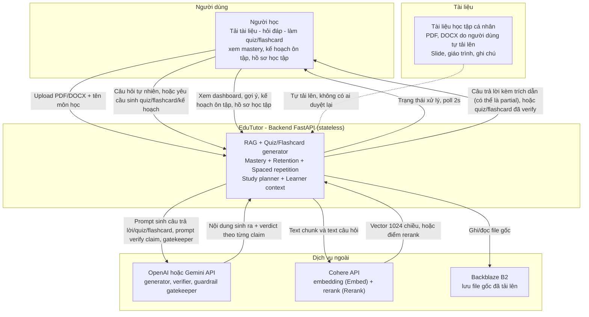

Không có lớp "văn bản tham chiếu bên ngoài" nào - hệ thống cố tình không tìm Internet trực tiếp, để câu trả lời luôn bám vào đúng tài liệu người học đã tải lên. Container backend không giữ trạng thái nào trên đĩa: DB+vector nằm ở Postgres (Neon), file gốc nằm ở Backblaze B2, cả hai đều là dịch vụ ngoài container.

---

## 2. Kiến trúc thành phần

Không có worker process riêng - xử lý tài liệu chạy nền trong cùng process FastAPI qua `BackgroundTasks`. Lớp `services/` là nơi tập trung logic nghiệp vụ thuần Python (không phụ thuộc FastAPI), được nhiều router dùng lại.

```mermaid
flowchart TB
    subgraph giaodien["Giao diện - React 18 + Vite"]
        UIUP["UploadPage - quản lý tài liệu + xem outline"]
        UICHAT["ChatPage - hỏi đáp + sidebar lịch sử hội thoại"]
        UIQUIZ["QuizPage - làm quiz, xem đáp án/giải thích"]
        UIFC["FlashcardsPage - board due/learning/mastered, đánh giá SM-2 rút gọn"]
        UIPLAN["StudyPlanPage - lịch ôn tập, quản lý ngày thi theo môn"]
        UIPROFILE["ProfilePage - trình độ khai báo vs suy ra, mục tiêu học"]
        UIDASH["DashboardPage - mastery, tài liệu gần đây"]
    end

    subgraph api["API - FastAPI + Uvicorn (app/routers/)"]
        DOCSVC["documents.py<br/>Nhận file, versioning, dedup theo content_hash, đẩy BackgroundTask, xoá tài liệu"]
        CHATSVC["chat.py<br/>Capability detect + guardrail + Summarize/Compare/Apply/QA + gợi ý + lịch sử"]
        COURSESVC["courses.py<br/>Liệt kê tên môn học đã dùng, đặt/xoá ngày thi theo môn (course_deadlines)"]
        QUIZSVC["quiz.py<br/>Sinh quiz đa tài liệu, chấm bài, cập nhật mastery"]
        FCSVC["flashcard.py<br/>Sinh, lưu từ câu trả lời, board, lịch sử, review SM-2 rút gọn"]
        MASTERYSVC["mastery.py (router)<br/>Đọc dashboard mastery + danh sách câu sai"]
        PLANSVC["study_plan.py<br/>Tính kế hoạch ôn tập theo course_deadlines + learning_policy"]
        PROFILESVC["profile.py<br/>Xem/cập nhật/xoá Learning Profile"]
    end

    subgraph nen["Xử lý nền - trong cùng process API"]
        BGTASK["_run_processing_job - FastAPI BackgroundTasks<br/>Parse, Chunk, trích outline, Embed, Index"]
    end

    subgraph services["Lớp Services - logic nghiệp vụ thuần Python (app/services/)"]
        QAPIPE["qa_pipeline.py<br/>2 pha strict/wide + near-miss + gợi ý chủ đề"]
        CAPDET["capability_detector.py<br/>rule-based: study_plan / recommendation / flashcard_due"]
        SUMSVC["summarize.py, compare.py, apply.py<br/>3 kiểu câu hỏi có contract output riêng"]
        STRUCT["structural_retrieval.py<br/>lấy trọn 1 chủ đề theo section_index, không phải top-k"]
        CTXASM["context_assembly.py<br/>lọc document_ids theo quyền + trạng thái + course"]
        LEARNCTX["learner_context.py<br/>gộp 3 lớp cá nhân hoá thành 1 lời gọi"]
        LEARNPOLICY["learning_policy.py, learning_state.py<br/>rule-based: nên quiz/flashcard/learn tiếp topic nào"]
        MASTERYLOGIC["mastery.py<br/>recency + difficulty weighted formula"]
        RETENTION["retention.py, spaced_repetition.py<br/>điểm ghi nhớ từ flashcard + lịch ôn SM-2 rút gọn"]
        MISCONCEPTION["misconception.py<br/>phát hiện đáp án sai lặp lại theo topic"]
        CITATIONSVC["citation.py<br/>câu hỗ trợ trích dẫn, resolve_topic theo overlap từ"]
    end

    subgraph logicgoc["Logic gốc - app/llm/, app/retrieval/, app/ingestion/"]
        RAGLOGIC["app/llm/rag.py<br/>generator + verifier theo claim, output_style, partial"]
        GUARD["app/llm/guardrail.py<br/>chặn injection/jailbreak/làm-bài-hộ"]
        QUIZLOGIC["app/llm/quiz_generator.py, flashcard_generator.py"]
        RETR["app/retrieval/pipeline.py, reranker.py, query_context.py"]
        INGEST["app/ingestion/parser.py, chunker.py, embedder.py, outline.py"]
    end

    subgraph luutru["Lưu trữ"]
        PG[("PostgreSQL + pgvector<br/>17 bảng: nghiệp vụ + vector cùng 1 DB")]
        B2[("Backblaze B2<br/>file gốc, S3-compatible")]
    end

    subgraph ngoai["Dịch vụ AI ngoài"]
        LLMAPI["OpenAI hoặc Gemini API"]
        COHEREAPI["Cohere API (Embed + Rerank)"]
    end

    subgraph memmod["app/memory/ - ký ức dài hạn theo sự kiện"]
        MEMSVC["service.py, scoring.py<br/>record_event / recall_events, điểm = 0.35 recency + 0.45 relevance + 0.20 importance"]
    end

    UIUP -->|"Nạp 1: POST file"| DOCSVC
    DOCSVC -->|"Nạp 2: Ghi Document status=đang xử lý"| PG
    DOCSVC -->|"Nạp 3: Lưu file gốc"| B2
    DOCSVC -->|"Nạp 4: add_task ngay trong response"| BGTASK
    BGTASK --> INGEST
    INGEST -->|"Embed chunk"| COHEREAPI
    BGTASK -->|"Ghi chunk + vector + outline"| PG

    UICHAT -->|"Hỏi 1"| CHATSVC
    CHATSVC --> CAPDET
    CHATSVC --> GUARD
    CHATSVC --> SUMSVC
    CHATSVC --> STRUCT
    CHATSVC --> CTXASM
    CHATSVC --> LEARNCTX
    LEARNCTX --> MASTERYLOGIC
    LEARNCTX --> MEMSVC
    CHATSVC --> QAPIPE
    QAPIPE --> RETR
    RETR -->|"embed câu hỏi, rerank ứng viên"| COHEREAPI
    RETR --> PG
    QAPIPE --> RAGLOGIC
    RAGLOGIC -->|"generator + verifier"| LLMAPI
    CHATSVC -->|"Hỏi cuối: lưu Message + ghi MemoryEvent"| PG

    UIQUIZ --> QUIZSVC
    QUIZSVC --> LEARNCTX
    QUIZSVC --> RETR
    QUIZSVC --> QUIZLOGIC
    QUIZLOGIC -->|"gọi LLM"| LLMAPI
    QUIZSVC -->|"Ghi Quiz/QuizItem/Attempt, cập nhật MasteryScore, MemoryEvent"| PG

    UIFC --> FCSVC
    FCSVC --> QUIZLOGIC
    FCSVC --> RETENTION
    FCSVC -->|"Ghi FlashcardReview, MemoryEvent"| PG

    UIPLAN --> PLANSVC
    UIPLAN --> COURSESVC
    PLANSVC --> LEARNPOLICY
    LEARNPOLICY --> MASTERYLOGIC
    LEARNPOLICY --> RETENTION
    PLANSVC -->|"đọc course_deadlines, ghi MemoryEvent khi đánh dấu đã ôn"| PG

    UIPROFILE --> PROFILESVC
    PROFILESVC -->|"đọc/ghi LearningProfile"| PG

    UIDASH --> MASTERYSVC
    MASTERYSVC --> MISCONCEPTION
    MASTERYSVC --> PG
```

---

## 3. Luồng nạp tài liệu

Không có hàng chờ duyệt của con người trước khi tài liệu vào truy hồi - tài liệu được dùng ngay khi xử lý xong. Dedup hiện dựa trên **nội dung** (`content_hash`, SHA-256), không chỉ tên file, để tránh nạp trùng cùng một tài liệu đổi tên.

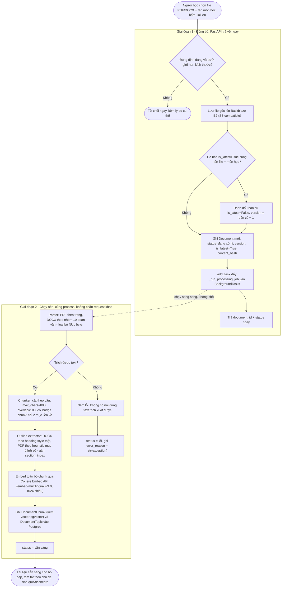

Metadata gắn vào mỗi chunk khi index: `document_id`, `document_name`, `position_ref` (Trang n / Mục n), `section_index` (để truy hồi cấu trúc theo chủ đề ở sơ đồ 5 và 6). `section_index` của chunk và của `DocumentTopic` cùng lấy từ một danh sách `sections` do `parser.py` sinh ra, nên luôn khớp nhau. Không có khái niệm "trạng thái duyệt nội dung" ở cấp chunk hay tài liệu - cơ chế đảm bảo không bịa nằm ở verifier LLM khi trả lời (sơ đồ 5), không nằm ở việc kiểm soát ai được đưa tài liệu vào.

Chunk hiện đang cắt theo ranh giới câu với kích thước tối đa cố định (800 ký tự, overlap 100), không phải semantic chunking - baseline đơn giản, xem `eval/reports/failure_analysis.md` để biết đây có phải chỗ đáng cải thiện hay không.

---

## 4. Sequence - nạp tài liệu và theo dõi trạng thái

Không có bảng job với phần trăm tiến độ - chỉ có `Document.status` (đang xử lý / sẵn sàng / lỗi), frontend tự poll lại bằng `setInterval` 2 giây.

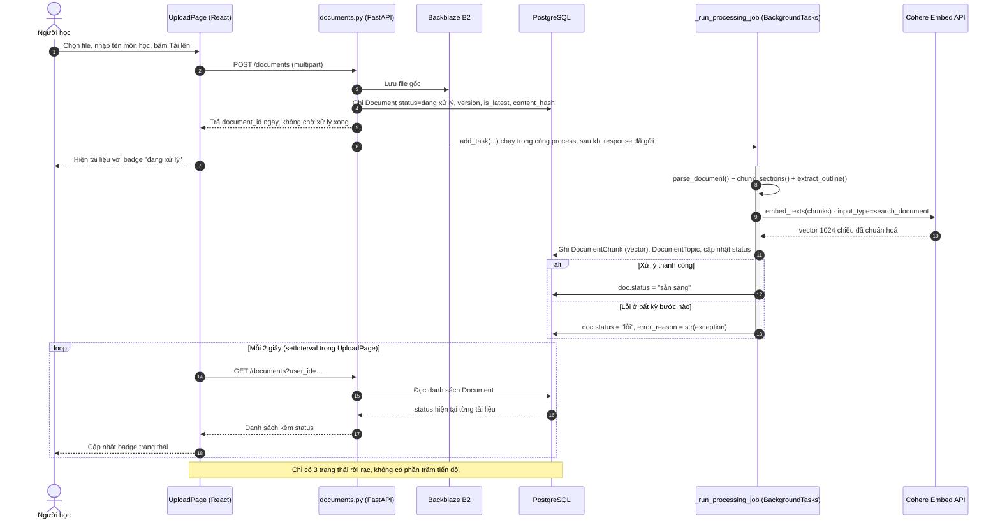

---

## 5. Agent/pipeline hỏi đáp

Đây là pipeline cố định, không phải agent tự chọn hành động tiếp theo. Câu hỏi đi qua 2 lớp phân loại rule-based (capability, rồi loại câu hỏi sinh nội dung) trước khi chạm tới generator+verifier - lớp nào cũng có thể dừng sớm mà không tốn lượt gọi LLM sinh nội dung.

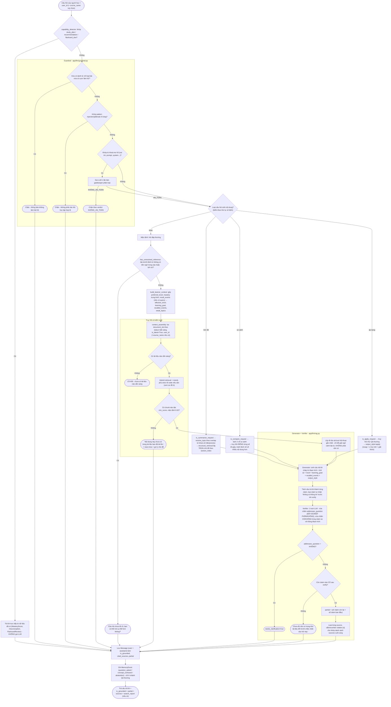

Không có nhánh riêng "phát hiện mâu thuẫn giữa nguồn rồi hỏi lại người dùng" - generator được chỉ dẫn tự nêu rõ khác biệt khi các đoạn trích đến từ nhiều nguồn mâu thuẫn nhau, đây là hành vi mong đợi ở output văn bản, không phải một nhánh graph riêng. Cờ `partial`, `injection_flag` và `search_report` trong response hiện chỉ được điền ở nhánh QA thường (qua `qa_pipeline.py`) - nhánh Summarize/Compare/Apply/capability đi thẳng qua `AnswerResult` và để các cờ này ở giá trị mặc định, dù bản thân `rag.py` đã tính được `partial` cho mọi nhánh gọi nó.

---

## 6. Hybrid retrieval

Lọc theo quyền và trạng thái tài liệu xảy ra trước khi truy hồi (tham số `document_ids` truyền tận vào `PgVectorStore`), không phải lọc kết quả sau khi đã tìm trên toàn bộ corpus. Truy hồi chạy tối đa 2 pha: `strict` trước, chỉ chạy `wide` (mở rộng) nếu `strict` không tìm được gì hoặc verifier không chấp nhận.

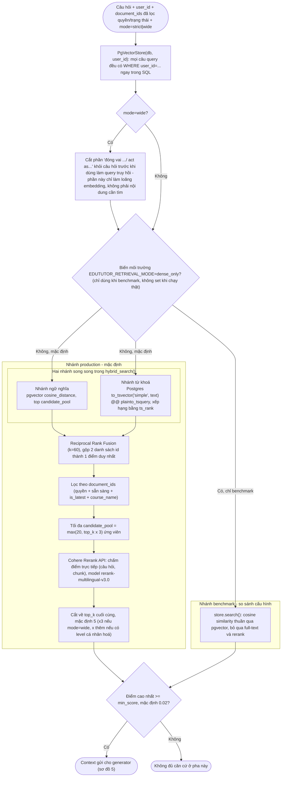

Vì sao cần cả 2 nhánh (dense + full-text) thay vì chỉ một: tài liệu học thuật có nhiều thuật ngữ/ký hiệu chính xác mà tìm ngữ nghĩa một mình dễ bỏ sót, còn tìm từ khoá thuần lại bỏ sót câu hỏi diễn đạt khác từ tài liệu gốc. Số liệu đo trực tiếp trên cấu hình hiện tại (393 case, Golden Set) nằm ở `eval/reports/evaluation_report.md`: `grounded_as_expected` 86.9%, độ chính xác trích dẫn 98.4%, nội dung đúng theo giám khảo LLM 97.8% khi hệ thống đã quyết định trả lời - khoảng cách với pass rate tổng thể (59.9%/267 case Q&A) chủ yếu do từ chối/hỏi lại oan, không phải do trả lời sai; nguyên nhân gốc theo từng nhóm case nằm ở `eval/reports/failure_analysis.md`.

---

## 7. Cá nhân hoá & bộ nhớ

3 lớp cá nhân hoá tách biệt, không gộp thành một con số duy nhất, và một hệ "ký ức" theo sự kiện riêng với lịch sử hội thoại thô. `learner_context.py` là điểm gộp DUY NHẤT của 3 lớp trước khi đưa vào prompt hoặc dùng để chọn độ khó.

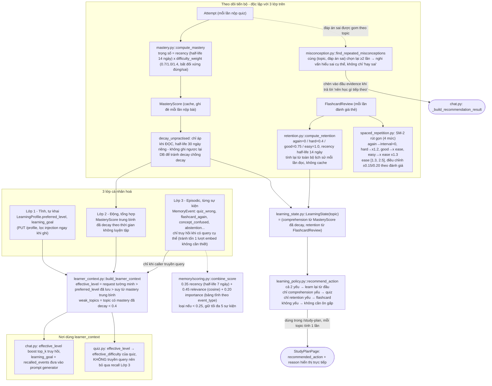

Khác biệt quan trọng với lịch sử hội thoại thô (`Conversation`/`Message`): `Message` chỉ phục vụ ngữ cảnh NGẮN HẠN trong đúng 1 cuộc hội thoại (đọc thẳng từ bảng, không embedding, không tìm kiếm ngữ nghĩa). `MemoryEvent` là log các SỰ KIỆN học tập cụ thể, xuyên suốt mọi cuộc hội thoại của người dùng, nội dung dựng bằng template cố định (không gọi LLM để viết), có embedding riêng để truy hồi theo ngữ nghĩa khi cần nhắc lại "lần trước bạn hay nhầm X với Y".

---

## 8. Sinh Quiz/Flashcard, mastery và spaced repetition

Cùng một pattern generator sinh hàng loạt rồi verify từng item được dùng lại cho cả Quiz và Flashcard. Nộp bài quiz kích hoạt tính lại mastery; đánh giá flashcard kích hoạt tính lịch ôn tiếp theo (SM-2 rút gọn) - hai vòng phản hồi độc lập nhau.

```mermaid
flowchart TB
    REQ(["Yêu cầu sinh quiz/flashcard: document_id(s) hoặc topic_name, tuỳ chọn difficulty/generation_mode"])
    DOCCHECK{"Tài liệu tồn tại, đúng user_id, status=sẵn sàng?"}
    ERR1(["Lỗi 400"])

    LEARNCTX2["build_learner_context: KHÔNG truyền query → effective_level (không recall Lớp 3)"]
    RETRPERDOC["Truy hồi riêng theo từng tài liệu (query = tên file), tránh dồn hết câu hỏi vào 1 tài liệu khi sinh đa tài liệu"]
    NOCHUNK{"Có chunk nào truy hồi được?"}
    ERR2(["Lỗi 400 - không tìm thấy nội dung để sinh"])

    GEN["Generator: 1 lượt gọi LLM sinh JSON N câu hỏi/thẻ + chunk_index tham chiếu"]
    PARSE{"JSON hợp lệ và là mảng?"}
    EMPTY1(["Trả rỗng, không cố sửa JSON hỏng"])

    LOOP["Với từng item trong mảng"]
    FIELDCHECK{"Đủ field bắt buộc và chunk_index hợp lệ?"}
    SKIP1["Bỏ qua item, không gọi verifier để đỡ tốn quota"]
    ITEMVERIFY["Verify riêng: LLM đọc chunk gốc + nội dung item, trả CÓ/KHÔNG"]
    ACCEPT{"Verifier trả CÓ?"}
    SKIP2["Loại item"]
    KEEP["Giữ item, gắn source_document/source_position + content_type (concept/definition/formula/fact/procedure)"]

    ALLEMPTY{"Còn item nào sau khi lọc?"}
    ERR3(["Lỗi 500 - không sinh được câu hỏi nào xác minh được"])
    SAVEQUIZ["Lưu Quiz/QuizItem (gắn difficulty, generation_mode) hoặc FlashcardSet/FlashcardItem, không trả correct_answer khi sinh quiz"]

    SUBMIT(["Người học nộp đáp án 1 câu quiz"])
    RECORDATTEMPT["Ghi Attempt(is_correct, selected_answer)"]
    RECOMPUTE["compute_mastery() trên toàn bộ lịch sử Attempt của topic, upsert MasteryScore"]
    MEMQUIZ["Ghi MemoryEvent (quiz_right / quiz_wrong)"]

    REVIEWCARD(["Người học đánh giá 1 thẻ flashcard: again/hard/good/easy"])
    SCHEDULE["schedule_next_review(): interval + ease mới theo SM-2 rút gọn"]
    SAVEREVIEW["Ghi FlashcardReview mới (interval_days, ease, next_due_at)"]
    MEMFC{"Đánh giá là again hoặc easy?"}
    MEMFCWRITE["Ghi MemoryEvent (flashcard_again / flashcard_easy)"]

    REQ --> DOCCHECK
    DOCCHECK -->|"Không"| ERR1
    DOCCHECK -->|"Có"| LEARNCTX2
    LEARNCTX2 --> RETRPERDOC
    RETRPERDOC --> NOCHUNK
    NOCHUNK -->|"Không"| ERR2
    NOCHUNK -->|"Có"| GEN
    GEN --> PARSE
    PARSE -->|"Không"| EMPTY1
    PARSE -->|"Có"| LOOP
    LOOP --> FIELDCHECK
    FIELDCHECK -->|"Không"| SKIP1
    FIELDCHECK -->|"Có"| ITEMVERIFY
    ITEMVERIFY --> ACCEPT
    ACCEPT -->|"Không"| SKIP2
    ACCEPT -->|"Có"| KEEP
    SKIP1 --> ALLEMPTY
    SKIP2 --> ALLEMPTY
    KEEP --> ALLEMPTY
    ALLEMPTY -->|"Không"| ERR3
    ALLEMPTY -->|"Có"| SAVEQUIZ

    SAVEQUIZ -.->|"Người học làm bài sau đó"| SUBMIT
    SUBMIT --> RECORDATTEMPT
    RECORDATTEMPT --> RECOMPUTE
    RECOMPUTE --> MEMQUIZ

    SAVEQUIZ -.->|"Người học ôn thẻ sau đó"| REVIEWCARD
    REVIEWCARD --> SCHEDULE
    SCHEDULE --> SAVEREVIEW
    SAVEREVIEW --> MEMFC
    MEMFC -->|"Có"| MEMFCWRITE
```

---

## 9a. Bản đồ dữ liệu

17 bảng gom thành 4 cụm - thêm cụm "Môn học & spaced repetition" so với thiết kế ban đầu, vì `course_deadlines` và `flashcard_reviews` không thuộc gọn vào 3 cụm cũ.

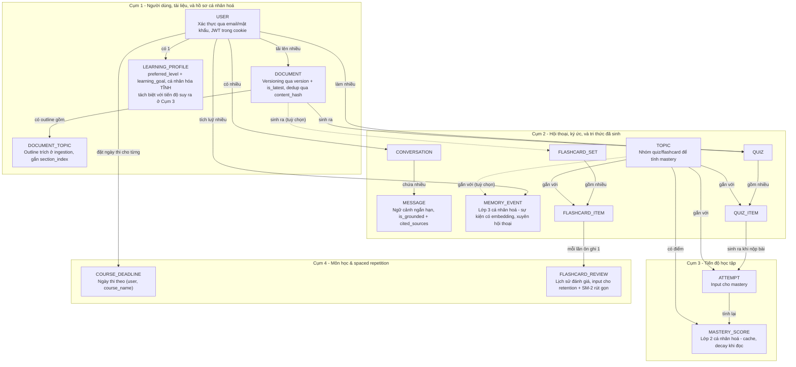

Không có bảng "chunk có trạng thái duyệt" - `DocumentChunk` (không nằm trong sơ đồ này, xem 9b) mang vector và text, không mang cờ duyệt nào. Việc không bịa được đảm bảo ở bước verifier khi trả lời (sơ đồ 5), không phải ở việc kiểm soát dữ liệu đầu vào.

---

## 9b. Schema chi tiết

Trường, kiểu dữ liệu và khoá của từng bảng, lấy trực tiếp từ `app/models.py`. `DOCUMENT_CHUNK` và cột `embedding` của `MEMORY_EVENT` dùng kiểu `Vector(1024)` (pgvector) - vector nằm NGAY TRONG bảng Postgres, không phải file/index rời.

```mermaid
erDiagram
    USER ||--o{ DOCUMENT : "tải lên"
    USER ||--o| LEARNING_PROFILE : "có tối đa 1"
    USER ||--o{ CONVERSATION : "có"
    CONVERSATION ||--o{ MESSAGE : "chứa"
    USER ||--o{ MEMORY_EVENT : "tích luỹ"
    TOPIC ||--o{ MEMORY_EVENT : "gắn (tuỳ chọn)"
    USER ||--o{ QUIZ : "làm"
    DOCUMENT ||--o{ QUIZ : "sinh ra"
    QUIZ ||--o{ QUIZ_ITEM : "gồm"
    TOPIC ||--o{ QUIZ_ITEM : "gắn"
    DOCUMENT ||--o{ FLASHCARD_SET : "sinh ra (tuỳ chọn)"
    FLASHCARD_SET ||--o{ FLASHCARD_ITEM : "gồm"
    TOPIC ||--o{ FLASHCARD_ITEM : "gắn"
    FLASHCARD_ITEM ||--o{ FLASHCARD_REVIEW : "mỗi lần ôn"
    QUIZ_ITEM ||--o{ ATTEMPT : "sinh ra"
    TOPIC ||--o{ ATTEMPT : "gắn"
    TOPIC ||--o{ MASTERY_SCORE : "có điểm"
    DOCUMENT ||--o{ DOCUMENT_TOPIC : "có outline"
    DOCUMENT ||--o{ DOCUMENT_CHUNK : "được chia thành"
    USER ||--o{ COURSE_DEADLINE : "đặt ngày thi"

    USER {
        string id PK
        string email UK
        string display_name
        datetime created_at
    }

    DOCUMENT {
        string id PK
        string user_id FK
        string file_name
        string display_name "nullable, nhãn người dùng tự đặt"
        string doc_type "tuỳ chọn"
        string course_name "tuỳ chọn"
        string status "đang xử lý, sẵn sàng, lỗi"
        text error_reason
        string content_hash "SHA-256, nullable, dedup theo nội dung"
        datetime uploaded_at
        int version
        boolean is_latest
    }

    DOCUMENT_CHUNK {
        string id PK
        string user_id FK
        string document_id FK
        string document_name
        string position_ref
        text text
        vector embedding "Vector(1024), pgvector"
        int section_index "nullable, khớp DOCUMENT_TOPIC"
        datetime created_at
    }

    DOCUMENT_TOPIC {
        string id PK
        string document_id FK
        string user_id FK
        string title
        string position_ref
        int order_index
        int section_index "nullable"
        datetime created_at
    }

    CONVERSATION {
        string id PK
        string user_id FK
        string course_name "tuỳ chọn"
        datetime created_at
    }

    MESSAGE {
        string id PK
        string conversation_id FK
        string role "user, assistant"
        text content
        text cited_sources "JSON"
        boolean is_grounded "null nếu role=user"
        datetime created_at
    }

    MEMORY_EVENT {
        string id PK
        string user_id FK
        string event_type
        string topic_id FK "nullable"
        text content "dựng bằng template cố định"
        float importance
        string source_ref "nullable"
        vector embedding "Vector(1024), nullable"
        datetime last_accessed_at "nullable, hiện chỉ quan sát"
        int access_count "nullable, hiện chỉ quan sát"
        datetime created_at
    }

    TOPIC {
        string id PK
        string user_id FK
        string course_name "tuỳ chọn"
        string name
    }

    COURSE_DEADLINE {
        string id PK
        string user_id FK
        string course_name
        date exam_date
        datetime updated_at
    }

    QUIZ {
        string id PK
        string user_id FK
        string document_id FK
        string generation_mode "nullable: learn/review/exam/weak_topics"
        datetime created_at
    }

    QUIZ_ITEM {
        string id PK
        string quiz_id FK
        string topic_id FK "tuỳ chọn"
        text question
        text options "JSON mảng 4 chuỗi"
        string correct_answer
        text explanation
        string source_document
        string source_position
        string difficulty "nullable"
        string content_type "nullable: concept/definition/formula/fact/procedure"
    }

    FLASHCARD_SET {
        string id PK
        string user_id FK
        string document_id FK "nullable - thẻ lưu từ câu trả lời không gắn tài liệu"
        string generation_mode "nullable"
        datetime created_at
    }

    FLASHCARD_ITEM {
        string id PK
        string flashcard_set_id FK
        string topic_id FK "tuỳ chọn"
        text front
        text back
        string source_document
        string source_position
        string content_type "nullable"
    }

    FLASHCARD_REVIEW {
        string id PK
        string user_id FK
        string flashcard_item_id FK
        string rating "again/hard/good/easy"
        float interval_days
        float ease
        datetime next_due_at
        datetime reviewed_at
    }

    ATTEMPT {
        string id PK
        string user_id FK
        string quiz_item_id FK
        string topic_id FK "tuỳ chọn"
        boolean is_correct
        text selected_answer "nullable, đáp án sai thực tế đã chọn"
        datetime attempted_at
    }

    MASTERY_SCORE {
        string id PK
        string user_id FK
        string topic_id FK
        float score "0-1, cache, upsert mỗi lần có Attempt mới"
        datetime updated_at
    }

    LEARNING_PROFILE {
        string id PK
        string user_id FK UK
        string preferred_level "beginner, advanced, hoặc rỗng"
        text learning_goal "tuỳ chọn, đã lọc injection khi ghi"
        datetime updated_at
    }
```

---

## 10. Vòng đời tài liệu

Ba trạng thái rời rạc, không có trạng thái trung gian theo phần trăm. Versioning là một trục riêng, không phải một trạng thái trong vòng đời xử lý. Dedup theo `content_hash` chạy TRƯỚC khi ghi Document mới, không phải một trạng thái.

```mermaid
stateDiagram-v2
    [*] --> DangXuLy: Upload, status = "đang xử lý"

    DangXuLy --> SanSang: Parse + chunk + trích outline + embed + index thành công
    DangXuLy --> Loi: Bất kỳ bước nào lỗi, ghi error_reason

    Loi --> [*]: Người dùng xoá tài liệu lỗi và tải lại từ đầu (chưa có nút thử lại tự động)

    SanSang --> DangXuLy: Upload lại cùng file_name + course_name, bản này version+1, is_latest=True; bản cũ is_latest=False, vẫn giữ trạng thái sẵn sàng

    SanSang --> [*]: Xoá tài liệu - xoá file gốc trên B2, bản ghi Document, và toàn bộ DocumentChunk/DocumentTopic liên quan trong cùng transaction

    note right of SanSang
        Chỉ tài liệu status=sẵn sàng và is_latest=True
        được dùng cho hỏi đáp, tóm tắt theo chủ đề, và sinh quiz/flashcard.
        Bản cũ (is_latest=False) vẫn hiện trong danh sách tài liệu
        nhưng không được dùng làm căn cứ truy hồi mới.
    end note

    note right of DangXuLy
        Không có phần trăm tiến độ.
        Frontend chỉ biết 3 trạng thái qua poll GET /documents mỗi 2 giây.
        Không có hàng đợi Redis/RQ, xử lý chạy trong
        cùng process API qua FastAPI BackgroundTasks.
        content_hash (SHA-256) được tính trước khi ghi Document,
        cho phép phát hiện tài liệu trùng nội dung dù đổi tên file.
    end note
```

---

## 11. Triển khai

Một container duy nhất cho backend (API + xử lý nền trong cùng process), hoàn toàn **stateless** - không có volume, không có đĩa bền vững nào cần thiết. Đây là điều kiện để chạy được trên host free tier không có persistent disk (Render).

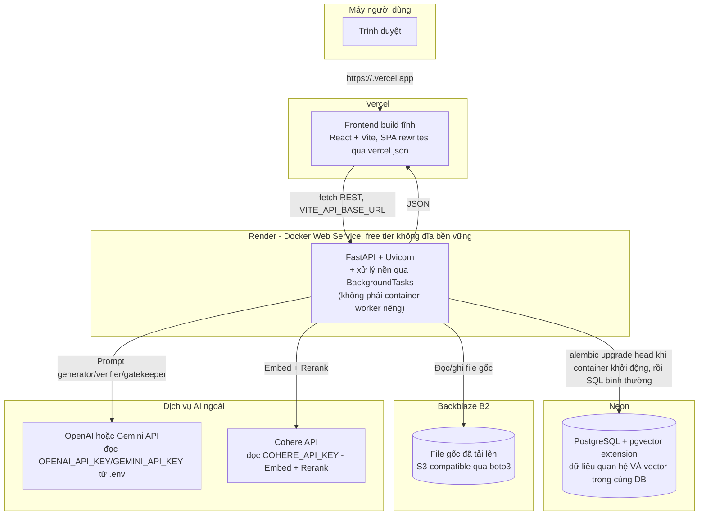

Vì sao một container là đủ: xử lý một tài liệu (parse + chunk + gọi Cohere embed) mất vài giây tới vài chục giây, không phải vài phút gọi LLM cho nội dung dài, nên chấp nhận được khi chạy trong `BackgroundTasks` cùng process thay vì tách sang worker riêng như Celery/RQ. Đánh đổi: nếu nhiều người dùng cùng lúc tải tài liệu lớn, xử lý nền có thể cạnh tranh CPU/network với các request đồng bộ khác trong cùng process - chưa phải vấn đề ở quy mô hiện tại, nhưng là chỗ cần xem lại đầu tiên nếu sau này mở rộng.

Vì sao stateless quan trọng hơn "một container là đủ": trước khi di trú sang Postgres+pgvector/Cohere/Backblaze B2, hệ thống dùng SQLite + FAISS + model local + đĩa cục bộ - không deploy được lên host free tier không có volume, vì container khởi động lại (rebuild, restart do free tier "ngủ") sẽ mất sạch dữ liệu. Toàn bộ trạng thái bền vững giờ nằm ở 2 dịch vụ ngoài container (Neon, Backblaze B2), nên container backend có thể bị huỷ/khởi tạo lại bất cứ lúc nào mà không mất dữ liệu người dùng.

Phương án thay thế nếu cần: tách `_run_processing_job` sang worker riêng (Redis + RQ) chỉ cần thiết khi có nhiều người dùng cùng lúc tải tài liệu lớn, chưa cần ở quy mô hiện tại.
